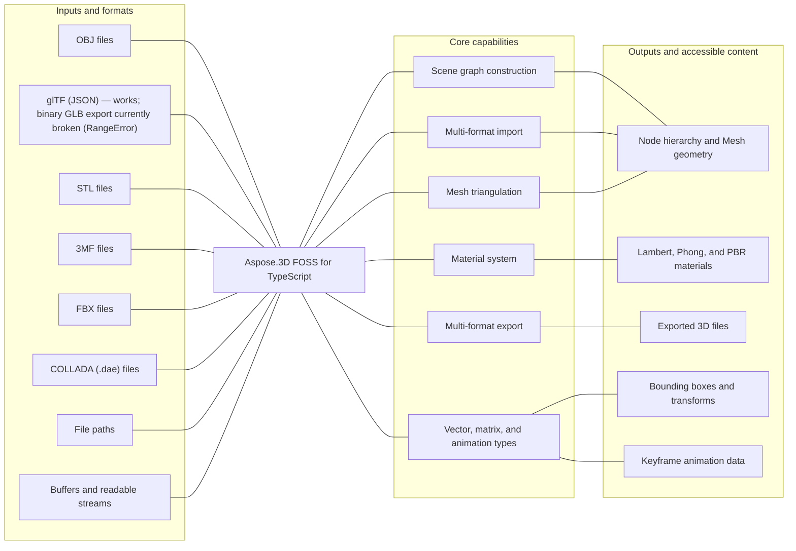

# Aspose.3D FOSS for TypeScript

 [](https://github.com/aspose-3d-foss/Aspose.3D-FOSS-for-TypeScript/graphs/contributors)

Aspose.3D FOSS for TypeScript is a free, open-source, MIT-licensed library for building, loading,
and exporting 3D scenes in Node.js and TypeScript. It exposes a strongly-typed scene-graph API —
`Scene`, `Node`, `Entity`, `Mesh`, `Camera`, `Light`, and `Transform` — together with importers and
exporters for OBJ, glTF 2.0/GLB, STL, 3MF, FBX, and COLLADA.

## Navigation

- [At a glance](#at-a-glance)
- [Key capabilities](#key-capabilities)
- [Installation](#installation)
- [Quick start](#quick-start)
- [Additional examples](#additional-examples)
- [API reference](#api-reference)
- [Documentation & resources](#documentation--resources)
- [Scope and limitations](#scope-and-limitations)
- [Development and testing](#development-and-testing)
- [License](#license)

## At a glance



## Key capabilities

- Build 3D scenes from scratch with `Scene`, `Node`, `Mesh`, and `Transform`, or load existing files
  with `Scene.open()` / `Scene.openFromBuffer()`.
- Import and export OBJ (with `.mtl` materials), glTF 2.0/GLB, STL (ASCII and binary), 3MF, FBX, and
  COLLADA (DAE) — `scene.save()` picks the format from the target extension or an explicit format
  object.
- Apply `LambertMaterial`, `PhongMaterial`, and `PbrMaterial` materials, including glTF-style
  metallic/roughness PBR channels.
- Triangulate arbitrary polygons with `Mesh.triangulate()` or the standalone
  `PolygonModifier.triangulate()`.
- Work with vector/matrix math primitives — `Vector2`, `Vector3`, `Vector4`, `Matrix4`, `Quaternion`,
  `BoundingBox` — and keyframe animation types (`AnimationClip`, `KeyframeSequence`,
  `Interpolation`).
- Fully typed API compiled under strict TypeScript settings (`noImplicitAny`, `strictNullChecks`).

## Installation

An npm package has not been published yet. Install from source:

```bash
git clone https://github.com/aspose-3d-foss/Aspose.3D-FOSS-for-TypeScript.git
cd Aspose.3D-FOSS-for-TypeScript
npm install
npm run build
```

`npm run build` compiles `src/` to `dist/` with `tsc`, mirroring the source layout — the scene-graph
API ends up at `dist/aspose/threed`, and each format module at `dist/aspose/threed/formats/<format>`
(for example `dist/aspose/threed/formats/obj`).

## Quick start

Load an OBJ file and inspect the imported scene:

```typescript
import { Scene } from './dist/aspose/threed';
import { ObjLoadOptions } from './dist/aspose/threed/formats/obj';

const scene = new Scene();
const options = new ObjLoadOptions();
options.enableMaterials = true;
scene.open('model.obj', options);

for (const node of scene.rootNode.childNodes) {
  if (node.entity) {
    console.log(`Node: ${node.name}`);
  }
}
```

Save the same scene as binary STL:

```typescript
scene.save('model.stl', 'stl');
```

## Additional examples

Every example below is exercised by the project's own test suite. See the [`tests`](tests/)
directory for the full set (there is no separate `examples/` directory). The most common
operations are collected below.

### Build a mesh from scratch and export to STL

```typescript
import { Scene, Node } from './dist/aspose/threed';
import { Mesh } from './dist/aspose/threed/entities';
import { Vector4 } from './dist/aspose/threed/utilities';

const scene = new Scene();
const mesh = new Mesh('triangle');
mesh.controlPoints = [
  new Vector4(0.0, 0.0, 0.0, 1.0),
  new Vector4(1.0, 0.0, 0.0, 1.0),
  new Vector4(1.0, 1.0, 0.0, 1.0),
];
mesh.createPolygon(0, 1, 2);

const node = new Node('triangle_node');
node.entity = mesh;
node.parentNode = scene.rootNode;

scene.save('triangle.stl');
```

<details>
<summary>View additional examples</summary>

### Apply a PBR material

```typescript
import { Scene } from './dist/aspose/threed';
import { Mesh } from './dist/aspose/threed/entities';
import { PbrMaterial } from './dist/aspose/threed/shading';
import { Vector3, Vector4 } from './dist/aspose/threed/utilities';

const scene = new Scene();
const material = new PbrMaterial('red_metal');
material.albedo = new Vector3(1.0, 0.0, 0.0);
material.metallicFactor = 0.8;
material.roughnessFactor = 0.3;

const mesh = new Mesh('cube');
mesh.controlPoints = [
  new Vector4(0, 0, 0, 1), new Vector4(1, 0, 0, 1),
  new Vector4(1, 1, 0, 1), new Vector4(0, 1, 0, 1),
];
mesh.createPolygon(0, 1, 2, 3);

const node = scene.rootNode.createChildNode('cube');
node.entity = mesh;
node.material = material;
```

### Triangulate polygons directly with PolygonModifier

```typescript
import { PolygonModifier } from './dist/aspose/threed/entities';
import { Vector4 } from './dist/aspose/threed/utilities';

const controlPoints = [
  new Vector4(0, 0, 0, 1),
  new Vector4(1, 0, 0, 1),
  new Vector4(0, 1, 0, 1),
  new Vector4(1, 1, 0, 1),
];
const quad = [0, 1, 3, 2];

const triangles = PolygonModifier.triangulate(controlPoints, [quad]);
console.log(triangles.length); // 2
```

### Export to COLLADA with a Phong material

```typescript
import { Scene } from './dist/aspose/threed';
import { Mesh } from './dist/aspose/threed/entities';
import { Vector3, Vector4 } from './dist/aspose/threed/utilities';
import { PhongMaterial } from './dist/aspose/threed/shading';

const scene = new Scene();
const mesh = new Mesh('TestMesh');
mesh.controlPoints.push(new Vector4(0.0, 0.0, 0.0, 1.0));
mesh.controlPoints.push(new Vector4(1.0, 0.0, 0.0, 1.0));
mesh.controlPoints.push(new Vector4(0.0, 1.0, 0.0, 1.0));
mesh.createPolygon(0, 1, 2);

const material = new PhongMaterial('RedMaterial');
material.diffuseColor = new Vector3(1.0, 0.0, 0.0);
material.specularColor = new Vector3(1.0, 1.0, 1.0);
material.shininess = 32.0;

const node = scene.rootNode.createChildNode('TestNode');
node.entity = mesh;
node.material = material;

scene.save('scene.dae');
```

### Convert STL to glTF

```typescript
import { Scene } from './dist/aspose/threed';
import { GltfSaveOptions } from './dist/aspose/threed/formats/gltf';

const scene = new Scene();
scene.open('mesh.stl');

const opts = new GltfSaveOptions();
opts.binaryMode = false;
scene.save('mesh.gltf', opts);
```

Binary glTF (`.glb`, `binaryMode = true`) currently throws a `RangeError` for any
non-empty mesh — see [Scope and limitations](#scope-and-limitations). Use the
JSON/ASCII form (`binaryMode = false`, the default) shown above until that is
fixed upstream.

### Inspect a PBR material imported from glTF

```typescript
import { Scene } from './dist/aspose/threed';
import { GltfLoadOptions } from './dist/aspose/threed/formats/gltf';
import { PbrMaterial } from './dist/aspose/threed/shading';
import * as fs from 'fs';

const scene = new Scene();
const options = new GltfLoadOptions();
const buffer = fs.readFileSync('model.gltf');
scene.openFromBuffer(buffer, options);

const node = scene.rootNode.childNodes[0];
if (node.material instanceof PbrMaterial) {
  console.log(node.material.name, node.material.metallicFactor, node.material.roughnessFactor);
}
```

### Vector and quaternion math

```typescript
import { Vector3, Quaternion, Matrix4 } from './dist/aspose/threed/utilities';

const v = new Vector3(1.0, 2.0, 3.0);
const q = new Quaternion(1.0, 0.0, 0.0, 0.0);
const m = new Matrix4();

console.log(v.length, q.length, m.determinant);
```

</details>

## API reference

The public entry points are the scene-graph module (`Scene`, `Node`, `Entity`, `Mesh`, `Transform`,
…) and one submodule per format (`formats/obj`, `formats/gltf`, `formats/stl`, `formats/threemf`,
`formats/fbx`, `formats/collada`) plus `entities`, `animation`, `shading`, and `utilities`. This
library exposes 142 public classes and enums in total; the sections below cover the classes most
applications interact with directly.

<details>
<summary>View the supported public API surface</summary>

### Core scene graph

- `Scene` (extends `SceneObject`)
  - `open(fileOrStream, options?) -> void` — accepts a file path (read via `fs`) or a readable stream
  - `openFromBuffer(buffer, options?) -> void` — detects format from magic bytes/content
  - `save(fileOrStream, formatOrOptions?, options?) -> void`
  - `saveToBuffer(format?, options?) -> Buffer`
  - `static fromFile(fileName) -> Scene`
  - `clear() -> void`
  - `createAnimationClip(name) -> AnimationClip`, `getAnimationClip(name) -> AnimationClip | null`
  - Properties: `rootNode: Node`, `subScenes: Scene[]`, `library: CustomObject[]`,
    `assetInfo: AssetInfo`, `animationClips: AnimationClip[]`, `currentAnimationClip`
- `Node` (extends `SceneObject`)
  - `addEntity(entity)`, `removeEntity(entity)`, `clearEntities()`
  - `addChildNode(node)`, `createChildNode(nodeName, entity?, material?) -> Node`
  - `getChild(indexOrName) -> Node | null`, `merge(node)`
  - `evaluateGlobalTransform(withGeometricTransform) -> Matrix4`
  - `getBoundingBox() -> BoundingBox`
  - Properties: `parentNode`, `childNodes: Node[]`, `entities: Entity[]`, `entity`,
    `materials: Material[]`, `material`, `transform: Transform`, `globalTransform`, `visible`,
    `excluded`
- `Entity` (extends `SceneObject`) — base for `Mesh`, `Camera`, `Light`; `getBoundingBox()`,
  `parentNodes`, `excluded`
- `SceneObject` (extends `A3DObject`) — adds `scene: Scene | null`
- `A3DObject` (implements `INamedObject`) — `findProperty`, `getProperty`, `setProperty`,
  `removeProperty`, `name`, `properties: PropertyCollection`
- `Transform` (extends `A3DObject`) — `setTranslation`, `setScale`, `setEulerAngles`,
  `setRotation`, `setPreRotation`/`setPostRotation`, `setGeometricTranslation`/`Scaling`/`Rotation`;
  properties `translation`, `scaling`, `rotation`, `eulerAngles`, `transformMatrix`
- `GlobalTransform` — read-only `translation`, `scale`, `eulerAngles`, `rotation`,
  `transformMatrix`, built from `constructor(matrix)`

### Geometry and mesh

- `Geometry` (extends `Entity`) — `addControlPoint`, `createElement`, `createElementUV`,
  `addElement`, `getElement`, `getVertexElementOfUV`; properties `vertexElements`, `controlPoints`
- `Mesh` (extends `Geometry`) — `createPolygon(...)` (variadic: 3 or 4 indices, or an index array),
  `getPolygonSize(index)`, `triangulate() -> Mesh`, `getBoundingBox()`; properties `edges`,
  `polygonCount`, `polygons: number[][]`
- `VertexElement`, `VertexElementFVector`, `VertexElementIntsTemplate` and the typed subclasses
  `VertexElementNormal`, `VertexElementTangent`, `VertexElementBinormal`, `VertexElementUV`,
  `VertexElementVertexColor`, `VertexElementSmoothingGroup` — `setData`, `setIndices`, `clear`,
  `copyTo`
- `PolygonModifier.triangulate(arg1, arg2, arg3?, arg4?) -> any` — standalone triangulation utility
- `VertexDeclaration`, `VertexField`, `Vertex` — vertex-buffer layout and per-vertex field access
  (`readVector3`, `readFVector4`, `readFloat`, …)

### Materials

- `Material` (extends `A3DObject`) — `getTexture(slotName)`, `setTexture(slotName, texture)`
- `LambertMaterial` (extends `Material`) — `emissiveColor`, `ambientColor`, `diffuseColor`,
  `transparentColor`, `transparency`
- `PhongMaterial` (extends `LambertMaterial`) — adds `specularColor`, `specularFactor`,
  `shininess`, `reflectionColor`, `reflectionFactor`
- `PbrMaterial` (extends `Material`) — `constructor(name?, albedo?)`, `static fromMaterial(material)`;
  properties `albedo`, `albedoTexture`, `normalTexture`, `metallicFactor`, `roughnessFactor`,
  `metallicRoughness`, `occlusionTexture`, `occlusionFactor`, `emissiveTexture`, `emissiveColor`,
  `transparency`
- `TextureBase` (extends `A3DObject`) — `content`

### Camera and lighting

- `Camera` (extends `Entity`) — `moveForward`, `getBoundingBox`; properties `nearPlane`, `farPlane`,
  `aspect`, `orthoHeight`, `fieldOfView`, `fieldOfViewX/Y`, `projectionType`, `apertureMode`
- `Light` (extends `Camera`) — adds `lightType: string`
- `ProjectionType` — `PERSPECTIVE`, `ORTHOGRAPHIC`
- `LightType` — `POINT`, `DIRECTIONAL`, `SPOT`, `AREA`, `VOLUME`

### Math utilities

- `Vector2(x, y)`, `Vector3(x, y, z)`, `Vector4(x, y, z, w)` — `dot`, `cross` (Vector3), `normalize`,
  `equals`, `parse(input)`, index accessors
- `FVector2`, `FVector3`, `FVector4` — single-precision counterparts with `add`, `sub`, `mul`, `div`
- `Matrix4()` / `Matrix4(matrix)` — `transpose`, `concatenate`, `inverse`, `decompose`, `setTRS`,
  `translate`, `scale`, `rotateFromEuler`, `rotate`, `toArray`; `identity()`
- `Quaternion(w, x, y, z)` — `normalize`, `conjugate`, `inverse`, `dot`, `concat`, `eulerAngles`,
  `fromEulerAngle`, `fromAngleAxis`, `fromRotation`, `slerp`, `toMatrix`
- `BoundingBox`, `BoundingBox2D`, `BoundingBoxExtent` — `merge`, `contains`, `overlapsWith`,
  `static null()`, `static infinite()`
- `MathUtils` — `toDegree`, `toRadian`, `calcNormal`, `findIntersection`, `pointInsideTriangle`,
  `rayIntersect`, `clamp`
- `TransformBuilder` — fluent composition of `scale`, `rotateDegree`/`rotateRadian`, `translate`,
  `append`/`prepend`, producing a `Matrix4`

### Animation

- `AnimationClip` (extends `SceneObject`) — `createAnimationNode(nodeName)`; `animations`,
  `description`, `start`, `stop`
- `AnimationNode` (extends `A3DObject`) — `findBindPoint`, `getBindPoint`, `createBindPoint`,
  `getKeyframeSequence`; `bindPoints`, `subAnimations`
- `AnimationChannel` (extends `KeyframeSequence`) — `componentType`, `defaultValue`,
  `keyframeSequence`
- `BindPoint` (extends `A3DObject`) — `addChannel`, `getKeyframeSequence`, `createKeyframeSequence`,
  `bindKeyframeSequence`, `getChannel`, `resetChannels`
- `KeyframeSequence` (extends `A3DObject`) — `reset`, `add(time, value, interpolation)`,
  `setBindPoint`; `keyFrames`, `postBehavior`, `preBehavior`
- `KeyFrame` — `time`, `value`, `interpolation`, `tangentWeightMode`, `stepMode`, tangent fields
- `Interpolation` — `CONSTANT`, `LINEAR`, `BEZIER`, `B_SPLINE`, `CARDINAL_SPLINE`, `TCB_SPLINE`
- `Extrapolation` / `ExtrapolationType` — `CONSTANT`, `GRADIENT`, `CYCLE`, `CYCLE_RELATIVE`,
  `OSCILLATE`
- `StepMode` — `PREVIOUS_VALUE`, `NEXT_VALUE`; `WeightedMode` — `NONE`, `OUT_WEIGHT`,
  `NEXT_IN_WEIGHT`, `BOTH`

### Format I/O

Base classes shared by every format: `FileFormat`, `Importer`, `Exporter`, `LoadOptions`,
`SaveOptions`, `FormatDetector`, `Plugin`, `IOConfig`, `IOService`.

Each of the six formats below follows the same `<Format>Format` / `<Format>Importer` /
`<Format>Exporter` / `<Format>LoadOptions` / `<Format>SaveOptions` / `<Format>FormatDetector` /
`<Format>Plugin` pattern, obtained through a singleton `getInstance()`:

- **OBJ** (`formats/obj`) — `ObjLoadOptions`: `flipCoordinateSystem`, `enableMaterials`, `scale`,
  `normalizeNormal`. `ObjSaveOptions`: `applyUnitScale`, `pointCloud`, `verbose`, `serializeW`,
  `enableMaterials`, `flipCoordinateSystem`, `axisSystem`.
- **glTF** (`formats/gltf`) — `GltfLoadOptions`: `flipTexCoordV`. `GltfSaveOptions`: `binaryMode`,
  `flipTexCoordV`.
- **STL** (`formats/stl`) — `StlLoadOptions`: `flipCoordinateSystem`, `scale`. `StlSaveOptions`:
  `flipCoordinateSystem`, `scale`, `binaryMode`.
- **3MF** (`formats/threemf`) — `ThreeMfFormat` adds `isBuildable`, `getTransformForBuild`,
  `setBuildable`, `setObjectType`, `getObjectType`. `ThreeMfSaveOptions`: `enableCompression`,
  `buildAll`, `flipCoordinateSystem`, `unit`, `prettyPrint`.
- **FBX** (`formats/fbx`) — `FbxLoadOptions`: `keepBuiltinGlobalSettings`. `FbxSaveOptions`:
  `embedTextures`.
- **COLLADA** (`formats/collada`) — `ColladaLoadOptions`: `flipCoordinateSystem`,
  `enableMaterials`, `scale`, `normalizeNormal`. `ColladaSaveOptions`: `flipCoordinateSystem`,
  `enableMaterials`, `indented`. `ColladaTransformStyle`: `COMPONENTS`, `MATRIX`.

### Properties and metadata

- `Property(name, value)` — `getExtra`, `setExtra`
- `PropertyCollection` — `findProperty`, `get`, `removeProperty`, iterable, `count`, `length`
- `CustomObject` (extends `A3DObject`) — free-form property bag
- `AssetInfo` (extends `A3DObject`) — scene-level metadata container
- `ImageRenderOptions` — `width`, `height`

</details>

## Documentation & resources

- **[Getting started guide](https://docs.aspose.org/3d/typescript/)** — installation, walkthroughs, and feature guides for this library.
- **[How-to guides & FAQ](https://kb.aspose.org/3d/typescript/)** — task-focused answers for common 3D-processing questions.
- **[Full API reference](https://reference.aspose.org/3d/typescript/)** — the complete, browsable reference for all 142 public types (the [API reference](#api-reference) section above covers the essentials).
- Found a bug or have a feature request? [Open an issue](https://github.com/aspose-3d-foss/Aspose.3D-FOSS-for-TypeScript/issues) on GitHub.

## Scope and limitations

This is a from-scratch TypeScript port of the Aspose.3D scene-graph model, not a native binding —
there are no compiled add-ons to install. A number of methods are present in the public API surface
but currently throw `not implemented` errors rather than performing the operation:

- Mesh boolean operations — `Mesh.union()`, `Mesh.difference()`, `Mesh.intersect()`, and
  `Mesh.doBoolean()` — plus `Mesh.optimize()` and `Mesh.isManifold()`.
- `Watermark.encodeWatermark()` / `Watermark.decodeWatermark()`.
- Path-based scene queries — `Node.selectSingleObject()` / `Node.selectObjects()`.
- `Scene.render()` (rendering a scene to a bitmap/image).
- The standalone `FileSystem` helpers (`createZipFileSystem`, `readFile`, `writeFile`,
  `createLocalFileSystem`, `createDummyFileSystem`).

Separately, 3MF import/export (`ThreeMfImporter`/`ThreeMfExporter`) requires the `adm-zip` package
at runtime, but `package.json` currently declares `adm-zip` only under `devDependencies`, not
`dependencies` — a plain `npm install` from source pulls it in, but consuming this package as a
dependency of another project would need `adm-zip` installed explicitly.

Two further runtime defects, both in `GltfExporter` (as of `24.12.0`):

- **Binary glTF export throws.** `scene.save(path, { binaryMode: true })` (or a `GltfSaveOptions`
  instance with `binaryMode = true`) throws `RangeError: The value of "offset" is out of range` for
  any mesh with actual geometry — `GltfExporter._writeGlb()` sizes its output buffer from the
  binary payload's *element* count instead of its *byte* length (4 bytes per float), so the buffer
  is always too small once real data is written. JSON/ASCII glTF export (`binaryMode = false`, the
  default) is unaffected.
- **glTF export does not round-trip node hierarchy.** `GltfExporter.export()` writes every node in
  the scene graph — not just true roots — into the exported file's `scenes[].nodes` array. Re-opening
  a glTF file this library exported therefore produces extra, duplicate top-level nodes that were not
  present in the original scene (a mesh node several levels deep ends up added directly under
  `scene.rootNode` a second time), which shifts `childNodes` indices and can silently break code that
  assumes `scene.rootNode.childNodes[0]` is the node it just exported. Importing well-formed glTF
  files produced by other tools is unaffected — the bug is specific to this exporter's own output.

For production feature completeness and formats beyond this open-source surface, see
[Aspose.3D Enterprise Edition](https://products.aspose.com/3d/).

## Development and testing

Install dependencies and build:

```bash
npm install
npm run build
```

Run the test suite (Jest via `ts-jest`, covering `tests/**/*.test.ts`):

```bash
npm run test
```

Type-check without emitting output:

```bash
npm run typecheck
```

## License

This project is licensed under the MIT License. The MIT License permits use, copying,
modification, distribution, sublicensing, and commercial use, provided its copyright and
permission notice are retained. The software is provided without warranty.
