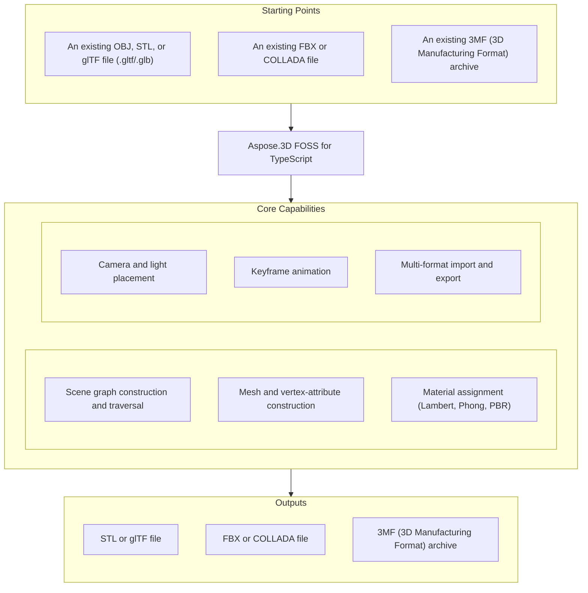

# Aspose.3D FOSS for TypeScript

[](#license) [](https://github.com/aspose-3d-foss/Aspose.3D-FOSS-for-TypeScript/graphs/contributors)

[](https://products.aspose.org/3d/typescript/)

Aspose.3D FOSS for TypeScript is a free, open-source, MIT-licensed TypeScript/JavaScript library
for building and converting 3D scenes in Node.js. It exposes an Aspose.3D-compatible scene-graph
API — `Scene`, `Node`, `Mesh`, `Material` — for constructing scenes from meshes and vertex
attribute data, assigning shading materials, animating node hierarchies with keyframes, and
reading and writing widely used interchange formats such as glTF, OBJ, STL, FBX, and COLLADA, as
pure TypeScript with no native bindings.

## Navigation

- [At a Glance](#at-a-glance)
- [Key Capabilities](#key-capabilities)
- [Installation](#installation)
- [Dependencies](#dependencies)
- [Quick Start](#quick-start)
- [Additional Examples](#additional-examples)
- [API Reference](#api-reference)
- [Documentation & Resources](#documentation--resources)
- [Scope and Limitations](#scope-and-limitations)
- [Development and Testing](#development-and-testing)
- [License](#license)

## At a Glance



## Key Capabilities

- Build and traverse a hierarchical scene graph with `Scene` and `Node` — every node holds a
  `Transform`, an optional `entity` (`Mesh`, `Camera`, or `Light`), and child nodes accessible via
  `childNodes`.
- Construct mesh geometry with `Mesh.controlPoints` and `createPolygon()`, and attach per-vertex
  attribute channels — normals (`VertexElementNormal`), UVs (`VertexElementUV`), and vertex color
  (`VertexElementVertexColor`) — through the `VertexElement` hierarchy.
- Triangulate raw polygon data with the standalone `PolygonModifier.triangulate()` utility, or
  triangulate an existing mesh's own polygons in place with `Mesh.triangulate()`.
- Assign shading materials through `Material` subclasses — `LambertMaterial` (diffuse-only),
  `PhongMaterial` (adds specular/shininess), and `PbrMaterial` (metallic/roughness, mapping
  directly to the glTF 2.0 PBR model).
- Place `Camera` (projection type, field of view, clip distances) and `Light` (`POINT`,
  `DIRECTIONAL`, `SPOT`, `AREA`, `VOLUME`) entities as scene nodes.
- Animate node properties with keyframes — `AnimationClip` groups `AnimationNode` tracks, each
  holding `AnimationChannel`s of `KeyframeSequence` time/value samples with configurable
  `Interpolation`/`Extrapolation`.
- Read glTF 2.0 (JSON and binary GLB) and Wavefront OBJ scenes, and write STL (ASCII and binary),
  FBX (ASCII), COLLADA (`.dae`, via `xmldom`), and glTF 2.0 JSON scenes through `scene.open()`/
  `scene.openFromBuffer()` and `scene.save()` — OBJ export and binary GLB export both carry real,
  current defects; see Scope and Limitations before relying on either.
- Read and write 3MF (3D Manufacturing Format) archives — suited to modern 3D printing
  workflows — through `ThreeMfImporter`/`ThreeMfExporter`; see the real npm packaging defect
  disclosed in Scope and Limitations before relying on this format in production.
- Configure per-format load/save behavior through dedicated options types (`ObjLoadOptions`/
  `ObjSaveOptions`, `GltfLoadOptions`/`GltfSaveOptions`, `StlLoadOptions`/`StlSaveOptions`,
  `FbxLoadOptions`/`FbxSaveOptions`).

## Installation

Install from source:

```bash
git clone https://github.com/aspose-3d-foss/Aspose.3D-FOSS-for-TypeScript.git
cd Aspose.3D-FOSS-for-TypeScript
npm install
npm run build
```

`npm run build` compiles `src/` to `dist/` with `tsc`. The package targets TypeScript 5.0+;
`package.json` declares no minimum Node.js version, and development is verified on Node.js
18/20/22.

## Dependencies

### Required Package Dependencies

- `xmldom` `^0.6.0` — parses and serializes XML for `ColladaImporter`/`ColladaExporter` and the
  internal XML content inside 3MF archives (`ThreeMfImporter`).

### Development Dependencies

- `typescript` `^5.8.3` — compiler.
- `jest` `^29.7.0`, `ts-jest` `^29.3.4` — test runner.
- `eslint` `^8.57.1`, `@typescript-eslint/eslint-plugin` `^8.33.0`, `@typescript-eslint/parser`
  `^8.33.0` — linting.
- `adm-zip` `^0.5.16`, `@types/adm-zip` `^0.5.7` — 3MF archive handling used in tests (see Scope
  and Limitations for a real packaging gap affecting a published install's use of this package).
- `@types/jest` `^29.5.12`, `@types/node` `^22.15.17` — TypeScript type declarations.

## Quick Start

Load an OBJ scene and re-save it as glTF (paths below assume you built the library per
Installation — there is no published package to import by name yet):

```typescript
import { Scene } from './dist/aspose/threed';

const scene = new Scene();
scene.open('model.obj');
scene.save('model.gltf');
```

## Additional Examples

Additional worked examples cover per-node inspection and configuring format-specific options.

Enumerate a loaded scene's node hierarchy and mesh statistics:

```typescript
import { Scene } from './dist/aspose/threed';

const scene = new Scene();
scene.open('model.obj');

for (const node of scene.rootNode.childNodes) {
    if (node.entity) {
        console.log(`Mesh: ${node.name}`);
        console.log(`  Control points: ${node.entity.controlPoints.length}`);
    }
}
```

<details><summary>View Additional Examples</summary>

### Load OBJ With Custom Options and Export to Binary STL

Load OBJ with explicit options and export as binary STL:

```typescript
import { Scene } from './dist/aspose/threed';
import { ObjLoadOptions } from './dist/aspose/threed/formats/obj';
import { StlSaveOptions } from './dist/aspose/threed/formats/stl';

const scene = new Scene();
const loadOptions = new ObjLoadOptions();
loadOptions.enableMaterials = true;
loadOptions.normalizeNormal = true;
scene.open('model.obj', loadOptions);

const saveOptions = new StlSaveOptions();
saveOptions.binaryMode = true;
scene.save('model.stl', saveOptions);
```

### Triangulate Raw Control Points With PolygonModifier

Triangulate raw control points directly with the standalone `PolygonModifier` utility (distinct
from `Mesh.triangulate()`, which triangulates an existing mesh's own polygons in place):

```typescript
import { PolygonModifier } from './dist/aspose/threed/entities';
import { Vector4 } from './dist/aspose/threed/utilities';

const controlPoints = [
    new Vector4(0, 0, 0, 1),
    new Vector4(1, 0, 0, 1),
    new Vector4(0, 1, 0, 1),
    new Vector4(1, 1, 0, 1),
];
const quad = [0, 1, 3, 2];
const triangles = PolygonModifier.triangulate(controlPoints, [quad]);
```

</details>

## API Reference

`Scene` is the primary entry point: `scene.open()`/`scene.openFromBuffer()` load a file or
buffer (format auto-detected), `scene.save()` writes output, and `scene.rootNode` exposes the
node hierarchy.

<details>
<summary>View Selected API Surface</summary>

### Core Scene Graph

| Class | Description |
|---|---|
| `Scene` | The root container for a 3D scene. Call `open()`/`openFromBuffer()` to load a file, `static fromFile(fileName)` to load one in a single call, and `save(fileOrStream, formatOrOptions?, options?)` to write output. Exposes `rootNode` as the entry point to the node hierarchy, and `createAnimationClip(name)`/`getAnimationClip(name)` to manage scene-level animation clips. |
| `Node` | A named node in the scene tree. Holds a `Transform` and zero or more child nodes accessible via `childNodes`, plus `getChild(indexOrName)`, `merge(node)`, and `evaluateGlobalTransform(withGeometricTransform)` to compute the accumulated world-space `Matrix4`. The `entity` accessor gets/sets the first attached entity for convenience, but a node can carry several: `addEntity(entity)`, `removeEntity(entity)`, and `clearEntities()` manage the full collection (mesh, camera, light, or other `SceneObject`). |
| `Entity` | Base class for all objects that can be attached to a `Node` as its primary entity. Subclassed by `Mesh`, `Camera`, and `Light`. |
| `SceneObject` | Abstract base for named objects that belong to a scene. Provides the `name` property and scene-membership tracking shared by nodes, entities, and asset-level objects. |
| `A3DObject` | Root base class for Aspose.3D objects. Provides the property system (`getProperty`, `setProperty`) and the `name` field shared across the class hierarchy. |

### Geometry and Mesh

| Class | Description |
|---|---|
| `Mesh` | Represents a polygon mesh. Contains a `controlPoints` array of `Vector4` vertices and polygon definitions created via `createPolygon()`. Call `triangulate()` to convert all polygons to triangles before export. Boolean operations (`union`/`difference`/`intersect`) and `optimize()`/`isManifold()` are not implemented in this FOSS build (see Scope and Limitations). |
| `Geometry` | Base class for all geometry types. Holds `controlPoints` and the `vertexElements` collection (normals, UVs, colors) attached to the geometry, managed via `addControlPoint`, `addElement`, `getElement`, `createElement`, `createElementUV`, and `getVertexElementOfUV`. |
| `VertexElement` | Base class for per-vertex attribute channels attached to a `Geometry`. Subclasses carry typed data arrays and `mappingMode`/`referenceMode` metadata. `setIndices()`/`clear()` are not implemented in this FOSS build. |
| `VertexElementNormal` | A `VertexElement` subclass that stores surface normals, internally as `FVector4[]`. Required by most renderers for correct lighting. |
| `VertexElementUV` | A `VertexElement` subclass that stores 2D texture coordinates. A single mesh may have multiple UV sets for different texture layers. |
| `VertexElementVertexColor` | A `VertexElement` subclass that stores per-vertex RGBA color values. |
| `VertexElementType` | Enumeration of the attribute channel types a `VertexElement` can represent (`NORMAL`, `UV`, `VERTEX_COLOR`, `TANGENT`, `BINORMAL`, and more). |
| `MappingMode` | Enumeration controlling how element data maps onto geometry: `CONTROL_POINT`, `POLYGON_VERTEX`, `POLYGON`, `EDGE`, or `ALL_SAME`. |
| `ReferenceMode` | Enumeration controlling how element indices reference data: `DIRECT` (one-to-one) or `INDEX_TO_DIRECT` (via an index array). |
| `TextureMapping` | Enumeration of texture channel semantics: `DIFFUSE`, `SPECULAR`, `NORMAL`, `EMISSIVE`, `BUMP`, and more. |

### Transform and Spatial

| Class | Description |
|---|---|
| `Transform` | Holds the local position (`translation`), rotation (`rotation` as `Quaternion`), and scale (`scaling`) of a `Node`, plus `eulerAngles` and `transformMatrix`. Setters cover both direct assignment (`setTranslation`, `setScale`, `setRotation`, `setEulerAngles`) and the pre/post-rotation and geometric variants (`setPreRotation`/`setPostRotation`, `setGeometricTranslation`/`Scaling`/`Rotation`). Changes here affect the node and all its children. |
| `GlobalTransform` | Read-only view of a node's world-space transform, computed by accumulating all ancestor `Transform` values. Access via `node.globalTransform`. |
| `BoundingBox` | An axis-aligned bounding box defined by a `minimum` and `maximum` `Vector3` corner, with `center`, `size`, and `extent` properties, `merge`, `contains`, `overlapsWith`, and static `null`/`infinite` factories. Two related utility types (not yet in `reference.aspose.org`'s own index) round out the family: `BoundingBox2D`, the 2D counterpart (`merge`, `overlapsWith`, `getCenter()`, `getSize()`, static `null`/`infinite`, but no `contains`), and `BoundingBoxExtent`, a plain `extentX`/`extentY`/`extentZ` value holder with static `null`/`finite`/`infinite` factories and no `merge`/`contains`/`overlapsWith` of its own. Nested `Node` bounding boxes are independent of ancestor transformations — recompute after applying transformations to keep bounding boxes accurate. |

### Materials

| Class | Description |
|---|---|
| `Material` | Abstract base class for all material types. |
| `LambertMaterial` | Diffuse-only material with `ambientColor`, `diffuseColor`, `emissiveColor`, `transparentColor`, and `transparency` properties. Suitable for non-specular surfaces. |
| `PhongMaterial` | Extends `LambertMaterial` with specular color and shininess properties for Phong shading. |
| `PbrMaterial` | Physically-based rendering material (`constructor(name?, albedo?)`, `static fromMaterial(material)`) with `albedo`, `albedoTexture`, `normalTexture`, `metallicFactor`, `roughnessFactor`, `metallicRoughness`, `occlusionTexture`, `occlusionFactor`, `emissiveTexture`, `emissiveColor`, and `transparency` properties. Maps directly to the glTF 2.0 PBR material model. |

### Camera and Lighting

| Class | Description |
|---|---|
| `Camera` | A viewpoint node entity with `moveForward` and `getBoundingBox` methods, and `nearPlane`, `farPlane`, `aspect`, `orthoHeight`, `fieldOfView`, `fieldOfViewX`/`Y`, `projectionType`, and `apertureMode` properties. |
| `Light` | A light-source node entity. Type is controlled by the `LightType` enumeration. |
| `LightType` | Enumeration of supported light kinds: `POINT`, `DIRECTIONAL`, `SPOT`, `AREA`, `VOLUME`. |
| `ProjectionType` | Enumeration of camera projection modes: `PERSPECTIVE` and `ORTHOGRAPHIC`. |

### Math Utilities

| Class | Description |
|---|---|
| `Vector3` | A three-component floating-point vector with `x`, `y`, `z` fields and common arithmetic methods (`dot`, `cross`, `normalize`, `minus`, `times`). |
| `Vector4` | A four-component floating-point vector with `x`, `y`, `z`, `w` fields. Used as the type of entries in `Mesh.controlPoints`. |
| `Vector2` | A two-component double-precision vector with `x` and `y` fields. Used for UV texture coordinates. |
| `FVector3` | A compact three-component single-precision float vector used in vertex element data arrays for normals and tangents. |
| `Matrix4` | A 4x4 transformation matrix (`Matrix4()` / `Matrix4(matrix)`), with `identity()`, `transpose`, `concatenate`, `inverse`, `decompose`, `setTRS`, `translate`, `scale`, `rotate`, `rotateFromEuler`, and `toArray`. |
| `Quaternion` | A unit quaternion for representing rotations without gimbal lock (`Quaternion(w, x, y, z)`). Provides `normalize`, `conjugate`, `inverse`, `dot`, `concat`, `slerp()` for smooth interpolation, `eulerAngles`, `fromEulerAngle`, `fromAngleAxis`, `fromRotation`, and `toMatrix`. |

### Animation

| Class | Description |
|---|---|
| `AnimationClip` | A named, time-bounded collection of `AnimationNode` tracks. The primary container for keyframe animation data loaded from FBX or COLLADA files. |
| `AnimationNode` | A named animation track that targets a specific property path on a scene object. Contains one or more `AnimationChannel` objects, accessible via `subAnimations` and `bindPoints`, with `findBindPoint`, `getBindPoint`, `createBindPoint`, and `getKeyframeSequence` to navigate them. |
| `AnimationChannel` | A single animated property channel within an `AnimationNode`. Holds a `KeyframeSequence` of time/value pairs. |
| `KeyFrame` | A single time/value sample in a `KeyframeSequence`. Carries the time stamp (in seconds), the value, and tangent information for interpolation. |
| `KeyframeSequence` | An ordered list of `KeyFrame` samples for one property channel, along with the `Interpolation` and `Extrapolation` settings that govern playback. |
| `Interpolation` | Enumeration of keyframe interpolation modes. Known members include `LINEAR` and `CONSTANT`. |
| `Extrapolation` | Defines behavior outside the keyframe range (before the first key and after the last key). Controlled by `ExtrapolationType`. |
| `StepMode` | Enumeration controlling how stepped (constant) interpolation is applied at boundaries: `PREVIOUS_VALUE`, `NEXT_VALUE`. |
| `WeightedMode` | Enumeration for Bezier tangent weight handling in keyframe animation: `NONE`, `OUT_WEIGHT`, `NEXT_IN_WEIGHT`, `BOTH`. |
| `ExtrapolationType` | Enumeration of out-of-range behaviors: `CONSTANT`, `GRADIENT`, `CYCLE`, `CYCLE_RELATIVE`, and `OSCILLATE`. |

### Format I/O

| Class | Description |
|---|---|
| `FileFormat` | Base descriptor for a 3D file format. Each supported format provides a concrete singleton via `getInstance()`. |
| `Importer` | Base class for format-specific import implementations. Not instantiated directly; invoked internally by `scene.open()`. |
| `Exporter` | Base class for format-specific export implementations. Not instantiated directly; invoked internally by `scene.save()`. |
| `LoadOptions` | Base class for format-specific load option objects. Pass a subclass instance to `scene.open()`/`scene.openFromBuffer()`. |
| `SaveOptions` | Base class for format-specific save option objects. Pass a subclass instance to `scene.save()`. |
| `IOService` | Internal service interface that abstracts file-system and buffer I/O for importers and exporters. |

### OBJ Format

| Class | Description |
|---|---|
| `ObjImporter` | Reads Wavefront OBJ files (`v`/`vt`/`vn`/`f`/`o`/`g`/`s` keywords) and populates a `Scene`. Recognizes `usemtl` but does not currently assign the referenced material — see Scope and Limitations. |
| `ObjExporter` | Writes Wavefront OBJ files, but only for geometry attached directly to `scene.rootNode` itself — see Scope and Limitations for the real traversal defect affecting the standard `createChildNode()` scene-construction pattern. Material data, when present, is embedded inline with no `mtllib`/`usemtl` linkage and no companion `.mtl` file. |
| `ObjLoadOptions` | Load options for OBJ files: `enableMaterials` (default `true`, currently has no effect — see Scope and Limitations), `flipCoordinateSystem`, `normalizeNormal` (default `true`), `scale`. |
| `ObjSaveOptions` | Save options for OBJ export. |
| `ObjFormat` | Format descriptor singleton for OBJ. Both `canImport` and `canExport` are `true`. |

### GLTF Format

| Class | Description |
|---|---|
| `GltfImporter` | Reads glTF 2.0 JSON (`.gltf`) and binary GLB (`.glb`) files, including embedded/external buffers, PBR materials, skins, and animation clips. |
| `GltfExporter` | Writes glTF 2.0 JSON output with a companion `.bin` buffer. Binary GLB output (`GltfSaveOptions.binaryMode: true`) currently throws a `RangeError` for any non-empty mesh — see Scope and Limitations. |
| `GltfLoadOptions` | Load options for glTF/GLB files, controlling buffer resolution and texture loading behavior. |
| `GltfSaveOptions` | Save options: `binaryMode` (default `false`; `true` currently throws for non-empty meshes — see Scope and Limitations), `flipTexCoordV` (default `true`). |
| `GltfFormat` | Format descriptor singleton. Obtain via `getInstance()` and pass to `scene.save()`. |

### STL Format

| Class | Description |
|---|---|
| `StlImporter` | Reads both ASCII and binary STL files into a `Scene` containing a single `Mesh` entity. |
| `StlExporter` | Writes binary STL. Non-triangle polygons are triangulated automatically. |
| `StlLoadOptions` | Load options for STL, controlling whether the importer flips normals during import. |
| `StlSaveOptions` | Save options: `binaryMode` (default `false`), controlling ASCII vs. binary output. |
| `StlFormat` | Format descriptor singleton. Obtain via `getInstance()`. |

### 3MF Format

| Class | Description |
|---|---|
| `ThreeMfImporter` | Reads Open Packaging Convention 3MF archives and populates a `Scene` with mesh objects, colors, and material properties. Depends on the `adm-zip` package at runtime — see Scope and Limitations for a real packaging defect. |
| `ThreeMfExporter` | Writes a valid 3MF archive from the current scene, suitable for 3D printing workflows. Same `adm-zip` runtime dependency as `ThreeMfImporter`. |
| `ThreeMfLoadOptions` | Load options for 3MF files: `flipCoordinateSystem`. |
| `ThreeMfSaveOptions` | Save options for 3MF export: `enableCompression`, `buildAll`, `flipCoordinateSystem`, `unit`, `prettyPrint`. |
| `ThreeMfFormat` | Format descriptor singleton. Obtain via `getInstance()`. Adds `isBuildable`, `getTransformForBuild`, `setBuildable`, `setObjectType`, and `getObjectType` for 3MF's build-instruction metadata. |

### FBX Format

| Class | Description |
|---|---|
| `FbxImporter` | Reads ASCII FBX files, including geometry, materials, and animation clips. |
| `FbxExporter` | Writes ASCII FBX output from the current scene. |
| `FbxLoadOptions` | Load options for FBX: `keepBuiltinGlobalSettings`. |
| `FbxSaveOptions` | Save options for FBX export: `embedTextures` (default `false`). |
| `FbxFormat` | Format descriptor singleton. Obtain via `getInstance()`. |

### COLLADA Format

| Class | Description |
|---|---|
| `ColladaImporter` | Reads COLLADA (`.dae`) XML files using `xmldom`. Handles geometry, materials, cameras, lights, and animation. |
| `ColladaExporter` | Writes COLLADA XML output from the current scene, suitable for interchange with DCC tools (Blender, Maya, and similar). |
| `ColladaFormat` | Format descriptor singleton. Obtain via `getInstance()`. |

### Properties System

| Class | Description |
|---|---|
| `Property` | A typed name/value pair that can be attached to any `A3DObject`. Supports scalar and vector value types. |
| `PropertyCollection` | An ordered, iterable container of `Property` objects (`count`, `length`), with `findProperty`, `get`, and `removeProperty`. Accessible on any `A3DObject` via the `properties` accessor. |
| `CustomObject` | A free-form property bag that extends `A3DObject`. Used to store arbitrary metadata that does not map to a standard class. |

### Asset Info

| Class | Description |
|---|---|
| `AssetInfo` | Carries scene-level metadata loaded from the source file: author, application name, creation date, unit scale, and coordinate axis information. |
| `ImageRenderOptions` | Options controlling how textures and images are resolved and encoded when saving to formats that embed image data (e.g. GLB with `binaryMode: true`). |

</details>

## Documentation & Resources

- **[Getting started guide](https://docs.aspose.org/3d/typescript/)** — installation, walkthroughs, and feature guides for this library.
- **[How-to articles and FAQ](https://kb.aspose.org/3d/typescript/)** — task-focused how-tos and answers to common questions.
- **[Full API reference](https://reference.aspose.org/3d/typescript/)** — complete, generated reference documentation for every public type.
- **[Issues and feature requests](https://github.com/aspose-3d-foss/Aspose.3D-FOSS-for-TypeScript/issues)** — report a bug or request a feature on GitHub.

## Scope and Limitations

- Rendering is not implemented in this FOSS build — `Scene.render()` throws an error.
- A real npm packaging defect affects 3MF import/export in this FOSS build — a normal package
  install does not pull in a dependency the 3MF code path needs at runtime, so using it throws
  immediately.
- `Mesh`'s Boolean operations (`union`, `difference`, `intersect`), `optimize()`, and
  `isManifold()` all throw `Error('... is not implemented')` in this FOSS build — mesh
  manipulation and modification beyond basic construction and triangulation is not currently
  functional. `Mesh`'s height-map constructor path is also not implemented.
- `VertexElement.setIndices()`/`clear()` throw `Error('... is not implemented')` in this FOSS
  build.
- `Node.selectSingleObject()`/`selectObjects()` throw `Error('... is not implemented')`.
- Text watermarking is not currently functional in this FOSS build (the identical defect
  independently confirmed on the sibling `3d/net` platform).
- The `FileSystem` virtualization abstraction (`readFile`, `writeFile`, `createZipFileSystem`,
  `createLocalFileSystem`, `createDummyFileSystem`) is entirely unimplemented in this FOSS build —
  every method throws. This does not affect ordinary `scene.open()`/`scene.save()` usage, which
  reads/writes directly through Node's own `fs` module rather than this abstraction.
- A real npm packaging defect affects this package's declared entry point — the real build does
  not produce the file `package.json` points consumers at, so a published install of this package
  as currently configured would fail to resolve on import; this README's own examples import from
  the real, present build output path instead of the package name.
- OBJ import does not currently assign per-face materials from the source file, regardless of the
  relevant load option's value — confirmed by direct testing against a real fixture.
- OBJ export only writes geometry attached at the very top of the scene graph — geometry attached
  via the standard child-node construction pattern used throughout this README and the product's
  own test suite is silently omitted from the output. When export does produce output, any
  material data present is not written in a form other tools can read back as a companion material
  file. Confirmed by direct testing.
- Binary GLB export currently fails for any non-empty mesh; the JSON/ASCII form (the default) is
  unaffected. Binary GLB import is unaffected either way — reading a real, externally-produced
  binary file into a scene works correctly. Confirmed by direct testing.
- Re-importing a scene this library exported to glTF can come back with extra, duplicate top-level
  nodes not present in the original — confirmed by direct testing. Importing files produced by
  other tools is unaffected.

These limitations don't apply to
[Aspose.3D — Enterprise Edition](https://products.aspose.com/3d/), which adds rendering,
additional exchange formats, and full production feature completeness.

## Development and Testing

Clone the repository and run the test suite:

```bash
git clone https://github.com/aspose-3d-foss/Aspose.3D-FOSS-for-TypeScript.git
cd Aspose.3D-FOSS-for-TypeScript
npm install
npm run build
npm test
```

Type-check and lint the source without emitting output:

```bash
npm run typecheck
npm run lint
```

See [AGENTS.md](AGENTS.md) in the repository root for implementation status and development
guidelines.

## License

This project is licensed under the MIT License. The MIT License permits use, copying, modification, distribution, sublicensing, and commercial use, provided its copyright and permission notice are retained. The software is provided without warranty.
